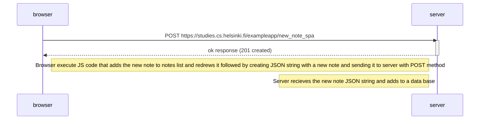

```mermaid


sequenceDiagram

  participant browser 
  participant server

  browser->>server: POST https://studies.cs.helsinki.fi/exampleapp/new_note_spa
  activate server
  server-->>browser: ok response (201 created)
  deactivate server 

  Note right of browser: Browser execute JS code that adds the new note to notes list and redrews it followed by creating JSON string with a new note and sending it to server with POST method
  Note left of server: Server recieves the new note JSON string and adds to a data base 
```

